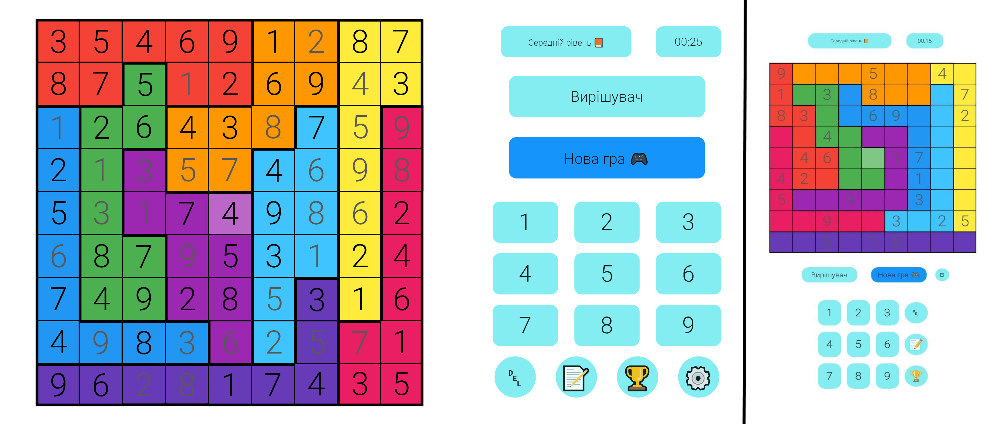

<h1>Nonomino</h1>

A new Nonomino project

---

## Dependencies

* [Dart](https://dart.dev/)
* [Flutter](https://flutter.dev/)
* [Shared preferences](https://pub.dev/packages/shared_preferences)
* [Easy Localization](https://pub.dev/packages/easy_localization)

## Controls

<table>
<thead>
<tr><th>Keyboard shortcut</th><th>Description</th></tr>
</thead>
<tbody>
<tr><td><kbd>Ctrl</kbd> + <kbd>R</kbd></td><td>Open the records dialog</td></tr>
<tr><td><kbd>Ctrl</kbd> + <kbd>N</kbd></td><td>Open the restart dialog</td></tr>
<tr><td><kbd>Ctrl</kbd> + <kbd>S</kbd></td><td>Open the settings dialog</td></tr>
<tr><td><kbd>Delete</kbd> or <kbd>Backspace</kbd></td><td>Delete the highlighted number</td></tr>
<tr><td><kbd>Tab</kbd></td><td>Enable/disable notes </td></tr>
<tr><td><kbd>Up</kbd> or <kbd>Down</kbd> or <kbd>Left</kbd> or <kbd>Right</kbd></td><td>Move the selection</td></tr>
<tr><td><kbd>1</kbd> or <kbd>2</kbd> or <kbd>3</kbd> or <kbd>4</kbd> or <kbd>5</kbd> or <kbd>6</kbd> or <kbd>7</kbd> or <kbd>8</kbd> or <kbd>9</kbd></td><td>Write the number</td></tr>
</tbody>
</table>